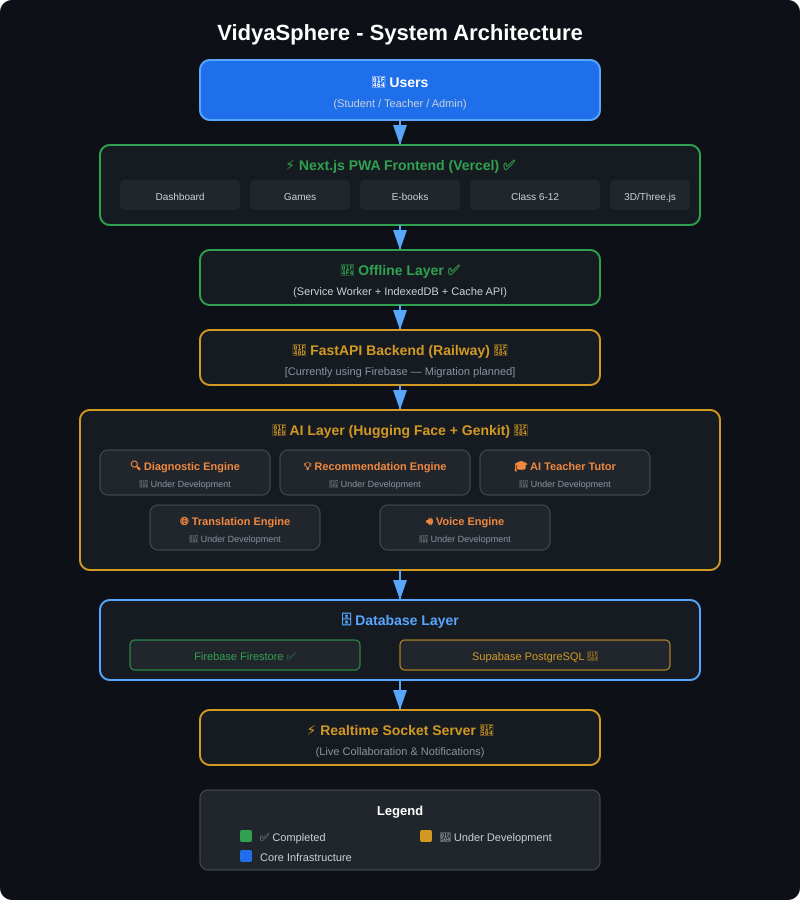

# VidyaSphere - Gamified STEM Learning Platform

## 🤖 Built with AI
**This entire project was completely generated and built using AI!**  
It leverages the power of **Firebase Studio** alongside the **Antigravity** AI to write the codebase, develop features, and architect the entire platform from scratch.

---

## 🌟 Overview
VidyaSphere is a modern, interactive, and gamified Web3-inspired STEM learning platform designed to make education immersive through 3D simulations and quizzes. Includes built-in offline capabilities (PWA) and multiple subjects tailored for various grade levels.

---

## 🏗️ System Architecture

<p align="center">
  
</p>

<details>
<summary>📋 Text Version (Click to expand)</summary>

```
┌─────────────────────────────────────────────────────────────────┐
│                         USERS                                    │
│              (Student / Teacher / Admin)                         │
└─────────────────────┬───────────────────────────────────────────┘
                      │
                      ▼
┌─────────────────────────────────────────────────────────────────┐
│              Next.js PWA Frontend (Vercel)                        │
│  ┌───────────┐ ┌──────────┐ ┌──────────┐ ┌───────────────────┐ │
│  │ Dashboard │ │  Games   │ │ E-books  │ │ Class Portals 6-12│ │
│  └───────────┘ └──────────┘ └──────────┘ └───────────────────┘ │
└─────────────────────┬───────────────────────────────────────────┘
                      │
                      ▼
┌─────────────────────────────────────────────────────────────────┐
│                    Offline Layer                                  │
│         (Service Worker + IndexedDB + Cache API)                 │
└─────────────────────┬───────────────────────────────────────────┘
                      │
                      ▼
┌─────────────────────────────────────────────────────────────────┐
│               FastAPI Backend (Railway)                           │
│         [🔄 Under Development - Currently Firebase]              │
└─────────────────────┬───────────────────────────────────────────┘
                      │
                      ▼
┌─────────────────────────────────────────────────────────────────┐
│                      AI Layer                                     │
│          (Hugging Face Inference API + Genkit)                    │
│  ┌──────────────┐ ┌────────────────────┐ ┌──────────────────┐  │
│  │  Diagnostic  │ │  Recommendation    │ │  AI Teacher      │  │
│  │  Engine 🔄   │ │  Engine 🔄         │ │  Tutor 🔄        │  │
│  └──────────────┘ └────────────────────┘ └──────────────────┘  │
│  ┌──────────────┐ ┌────────────────────┐                        │
│  │ Translation  │ │  Voice Engine 🔄   │                        │
│  │ Engine 🔄    │ └────────────────────┘                        │
│  └──────────────┘                                                │
└─────────────────────┬───────────────────────────────────────────┘
                      │
                      ▼
┌─────────────────────────────────────────────────────────────────┐
│             Database Layer                                        │
│  ┌──────────────────────┐  ┌─────────────────────────────────┐  │
│  │ Firebase Firestore ✅ │  │ Supabase PostgreSQL 🔄          │  │
│  └──────────────────────┘  └─────────────────────────────────┘  │
└─────────────────────┬───────────────────────────────────────────┘
                      │
                      ▼
┌─────────────────────────────────────────────────────────────────┐
│          Realtime Socket Server 🔄                                │
│       (Live Collaboration & Notifications)                       │
└─────────────────────────────────────────────────────────────────┘

Legend:  ✅ = Completed    🔄 = Under Development
```

</details>

---

## 📊 Feature Implementation Status

### ✅ Completed Features

| # | Feature | Technology | Status |
|---|---------|-----------|--------|
| 1 | Next.js PWA Frontend | Next.js 15 + Turbopack | ✅ Done |
| 2 | Offline Support | Service Worker + Cache API | ✅ Done |
| 3 | Firebase Authentication | Firebase Auth (Email/Password) | ✅ Done |
| 4 | Firestore Database | Cloud Firestore | ✅ Done |
| 5 | Interactive Games & Simulations | Three.js + React | ✅ Done |
| 6 | Multilingual Support | Static JSON (EN, HI, BN, TA, TE) | ✅ Done |
| 7 | Class Dashboards (6-12) | Dynamic Routing | ✅ Done |
| 8 | Progress Tracking | Firestore + Charts | ✅ Done |
| 9 | Achievements & Gamification | Coin System + Badges | ✅ Done |
| 10 | 3D Rendering (Science Arena) | Three.js | ✅ Done |
| 11 | E-books, Videos, Worksheets | Content Modules | ✅ Done |
| 12 | AI Integration (Base Setup) | Google Genkit | ✅ Done |
| 13 | Responsive UI | Tailwind CSS + Shadcn UI | ✅ Done |

### 🔄 Under Development

| # | Feature | Planned Technology | Status |
|---|---------|-------------------|--------|
| 1 | FastAPI Backend | Python FastAPI + Railway | 🔄 In Progress |
| 2 | AI Diagnostic Engine | Hugging Face Inference API | 🔄 In Progress |
| 3 | AI Recommendation Engine | Collaborative Filtering + ML | 🔄 In Progress |
| 4 | AI Teacher Tutor | LLM-based Chatbot | 🔄 In Progress |
| 5 | AI Translation Engine | Dynamic Neural Translation | 🔄 In Progress |
| 6 | Voice Engine | Text-to-Speech / Speech-to-Text | 🔄 In Progress |
| 7 | Supabase PostgreSQL | Supabase + PostgreSQL | 🔄 In Progress |
| 8 | Realtime Socket Server | WebSocket / Socket.IO | 🔄 In Progress |

---

## 🚀 Key Features
- **3D Interactive Simulations**: Uses Three.js for immersive learning (e.g. Hardware Sorters, Math Puzzles, Science Arena).
- **Offline Mode (PWA)**: Access previously visited content and lessons without an internet connection.
- **Progress Tracking & Dashboards**: Dedicated portals for classes 6 through 12.
- **Multilingual Support**: Read content seamlessly in 5 native languages (English, Hindi, Bengali, Tamil, Telugu).
- **Gamification**: Achievement coins, badges, and leaderboard system.

---

## 🔑 Test Credentials
To explore the platform and bypass registration, please use the following test account:
- **Email:** `siddhi123@gmail.com`
- **Password:** `Siddhi2004@`

---

## 🎮 How to Navigate & Use
1. **Access the Dashboard**:
   - Open the web application and click on **Login**. Enter the test credentials provided above.
2. **Setup Your Profile**:
   - Once logged in, your profile dashboard will auto-route to your designated grade level (e.g., Class 6).
3. **Explore Subjects**:
   - Look through the different subjects available to you, including Mathematics, Science, Engineering, and Technology.
   - You can access worksheets, e-books, and video lectures.
4. **Play Games & Simulations**:
   - Navigate to the **Simulations** or **Games** tab.
   - Here, interact with dynamic Three.js modules, tackle various interactive learning challenges, and earn points automatically!
5. **Install for Offline Usage**:
   - When using a supported browser (Chrome, Edge), click the **Install App** icon in your browser's address bar to install VidyaSphere as a progressive web app (PWA) and access cached learning paths while offline.

---

## 🛠️ Tech Stack

| Layer | Technology | Status |
|-------|-----------|--------|
| **Frontend** | Next.js 15 (App Router + Turbopack) | ✅ |
| **Styling** | Tailwind CSS + Shadcn UI | ✅ |
| **Auth & DB** | Firebase Auth + Firestore | ✅ |
| **3D Engine** | Three.js | ✅ |
| **PWA** | @ducanh2912/next-pwa + Service Workers | ✅ |
| **AI (Base)** | Google Genkit | ✅ |
| **Backend API** | FastAPI (Python) | 🔄 |
| **AI Inference** | Hugging Face API | 🔄 |
| **Database v2** | Supabase PostgreSQL | 🔄 |
| **Realtime** | Socket.IO / WebSocket | 🔄 |

## 💻 Local Setup Instructions
If you wish to run the platform locally on your own machine, follow these steps:

1. **Clone the repository:**
   ```bash
   git clone https://github.com/Vivek-2004V/gamified_learning_paltform.git
   ```
2. **Install dependencies:**
   ```bash
   npm install --legacy-peer-deps
   ```
3. **Start the development server:**
   ```bash
   npm run dev
   ```
4. **View the Application:**
   Open [http://localhost:3000](http://localhost:3000) with your browser to see the result.

## 🔧 Troubleshooting & Problem Solving

If you encounter any issues while using or setting up the platform, here are some common problems and their solutions:

### 1. Installation Errors
**Problem:** `npm install` fails with dependency conflict errors.
**Solution:** The project uses specific versions of dependencies. Always run the installation with the `--legacy-peer-deps` flag:
```bash
npm install --legacy-peer-deps
```

### 2. Build or Development Server Issues
**Problem:** `npm run dev` fails, or you see a PostCSS error.
**Solution:** Sometimes clearing the Next.js cache can resolve build issues:
```bash
rm -rf .next
npm run dev
```

### 3. Login/Authentication Problems
**Problem:** Cannot log in with the test credentials, or it says "Invalid Credentials".
**Solution:** 
- Double-check the email (`siddhi123@gmail.com`) and password (`Siddhi2004@`). 
- Ensure there are no spaces at the beginning or end of the password.
- Check your internet connection. Authentication requires Firebase to connect to its servers.

### 4. 3D Simulations Not Loading
**Problem:** The screen stays blank or lags when opening a 3D simulation.
**Solution:**
- **Hardware Acceleration:** Ensure hardware acceleration is enabled in your browser settings (Chrome: `Settings > System > Use graphics acceleration when available`).
- **Device Performance:** Close background tabs or applications. Three.js requires decent GPU power to render smoothly.

### 5. Offline Mode (PWA) Not Working
**Problem:** The app does not load without the internet.
**Solution:** 
- You must install the PWA first while online. Look for the install icon in the URL bar.
- Once installed, open the app from your desktop/home screen. Note that only previously visited lessons and cached assets will be available offline.
- Try clearing your browser cache and Service Workers to reinstall the PWA.

### 6. UI or Styling Looks Broken
**Problem:** Buttons are misaligned or colors are incorrect.
**Solution:** Perform a hard refresh of the page:
- **Windows/Linux:** `Ctrl + F5` or `Ctrl + Shift + R`
- **Mac:** `Cmd + Shift + R`

### 7. Server / Client Component Issue
**Problem:** ❌ You see an error like `You're importing a component that needs "use client"`.
**Solution:** This happens when a React hook or browser API is used inside a Next.js Server Component without marking it as a Client Component.
**✅ Fix:** Add the following directive to the very top of the problematic file:
```tsx
"use client";
```

**Still having issues?** 
If your problem is not listed above, check the browser console (`F12` or `Right Click -> Inspect -> Console`) for any red error messages. You can use these messages to diagnose the root cause or open an issue on the GitHub repository.

---

## 🗺️ Roadmap

```
Phase 1 (✅ Completed)
├── Next.js PWA Frontend
├── Firebase Auth + Firestore
├── Three.js Game Simulations
├── Multilingual Static Translations (5 languages)
├── Class 6-12 Dashboards
├── Progress Tracking & Achievements
├── E-books, Videos, Worksheets
└── Offline Support (Service Workers)

Phase 2 (🔄 In Progress)
├── FastAPI Backend Migration
├── Supabase PostgreSQL Integration
├── Hugging Face AI Inference Layer
├── AI Diagnostic Engine
├── AI Recommendation Engine
├── AI Teacher Tutor (LLM Chatbot)
├── Dynamic AI Translation Engine
├── Voice Engine (TTS/STT)
└── Realtime Socket Server
```

---

## 📁 Project Structure

```
VidyaSphere/
├── public/                  # Static assets, PWA files
│   ├── manifest.json        # PWA manifest
│   ├── service-worker.js    # Offline caching
│   └── sw.js                # Service worker entry
├── src/
│   ├── ai/                  # AI integration (Genkit)
│   ├── app/                 # Next.js App Router pages
│   │   ├── class-6/ to class-12/   # Grade-level portals
│   │   ├── dashboard/       # User dashboard
│   │   ├── games/           # Interactive simulations
│   │   ├── login/           # Authentication
│   │   └── signup/          # Registration
│   ├── components/          # Reusable UI components
│   ├── context/             # React contexts (language)
│   ├── firebase/            # Firebase config & providers
│   ├── hooks/               # Custom React hooks
│   ├── lib/                 # Utilities & data
│   └── locales/             # i18n translation files
├── docs/                    # Documentation
├── next.config.ts           # Next.js + PWA config
├── tailwind.config.ts       # Tailwind CSS config
└── package.json             # Dependencies
```

---

## 👥 Team & Contributors

Built with ❤️ using AI-powered development tools.

---

## 📄 License

This project is for educational purposes.
